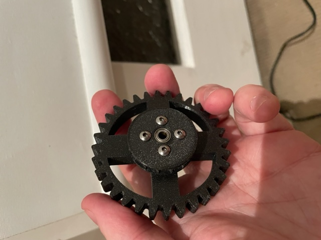

# ESPBlinds - Wifi Controlled Roller Blinds

STLs are available in the [files](files) folder in this repo, and on thingiverse at: https://www.thingiverse.com/thing:5321952

## Arduino Program
This Repo contains the Arduino program used to run the ESP-8266 controller.

The code has been tested on Arduino IDE v1.8.19 on Linux and Mac, if you have issues compiling please try using this version of the Arduino IDE.

### Constants file
**IMPORTANT: You need to create constants.h**

Copy-paste the file `constants.example.h` to `constants.h` and fill update at minimum the following variables:
 - `WIFI_SSID`
 - `WIFI_PASSWORD`
 - `MQTT_SERVER`
 - `MQTT_USER`
 - `MQTT_PASSWORD`

All MQTT topics are also defined in `constants.h`, feel free to customise these if you prefer different topic naming.

### Arduino Libraries 
Please ensure the following Arduino Libraries are installed using the Arduino Library Manager:
 - ESP8266WiFi - https://arduino-esp8266.readthedocs.io/en/latest/esp8266wifi/readme.html
 - PubSubClient -  https://www.arduino.cc/reference/en/libraries/pubsubclient/

### Compiling for ESP8266
If you are using the ESP-12F modukle as I did, use the following Board settings in Arduino IDE:
- Board: `NodeMCU 1.0 (ESP-12E)`
- Upload Speed: `115200`
- (I left all other settings as the default)

## Parts used
 - 2.8v 1.7A Stepper Driver (SY42STH38-1684A): https://www.pololu.com/product/2267
 - DRV8825 Stepper Motor Driver: https://www.pololu.com/product/2133
 - ESP8266 12-F: https://www.katranji.com/tocimages/files/423280-229082.pdf
 - 12v DC 50mm Fan: https://core-electronics.com.au/extruder-50mm-fan.html
 - 12v 2A DC Power Supply (no link - just make sure the amperage is higher than your stepper, with some room to breath to also run the ESP8266)
 - 4x8x3mm Bearings for the main gear - https://core-electronics.com.au/makeblock-plain-ball-bearing-4-8-3mm-10-pack.html
 - M3x8mm screws (x4) for mounting the motor
 - M3x4mm screws (x4) for mounting the lid
 - 4x wood screws to mount the whole thing to the wall - you will need to decide the best screws to use based on what your wall is made out of.

...and some generic electronics components, such as 3.3v regulator, capacitors, resistors, and NPN transistors.

See the schematic for full details

**NOTE** The schematic shows the A4988 Stepper Driver, which was from a previous iteration. I am now using the DRV8255 which has a slightly different pinout.

Most notably on the DRV8255, the VDD pin is not present and instead replaced by the FAULT pin (which I am not using), and the RST and SLP pins go to 3.3v rather than being tied to each other.

## Mounting instructions
- First mount the enclosure to the wall. The motor covers one of the screw holes.
- Mount the stepper motor before adding the main gear - it covers access to 2 of the motor screw holes
- Then put in the main gear and everything else
- Then add on the lid!

### Some more pics

Main gear with ball-chain gear attachment

---

Ball-chain gear attachment (another angle)

---

Control Board (with A4988 instead of DRV8255 stepper driver)

---

Housing with stepper motor and gear installed

---

Housing with stepper motorm, gears, and board installed

---

Everything ready to go, just need to put the lid on
